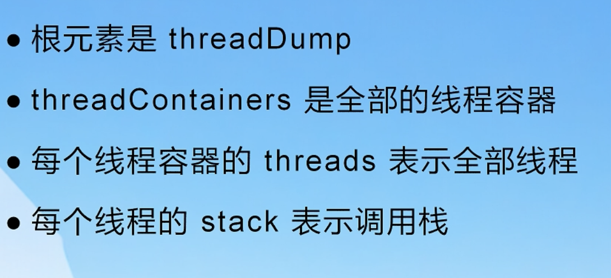
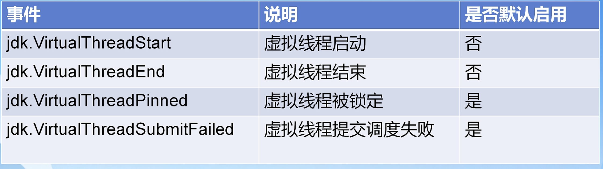
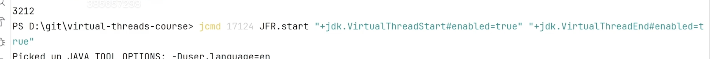

vertx/netty/**[quarkus](https://github.com/leviYX/quarkus)**

# 虚拟线程的调度

## 1、特点

- 虚拟线程被平台线程调度(称之为绑定，mount)
- 发生阻塞，从平台线程卸载(unmount)
- mount和unmount是透明的，在jdk中实现，少量代码在jvm中实现https://github.com/openjdk/jdk/blob/master/src/hotspot/share/runtime/continuationFreezeThaw.cpp
- 当虚拟线程运行的时候，载体不可见。他们的stack trace 他们的tl都是分离的。
- 当你使用Thread.currentThread的时候获取的就是当前运行的线程，对用户表义一样。代码中会重新set。你可能会说，虚拟线程也是平台线程运行的，那么咋获取的还是虚拟线程呢 

## 2、无法unmount

### 1、一些文件和网络的io操作

其中包括Object.wait和一些文件操作的fileoutputStream，源码有Blocker

### 2、synchronized/native方法(pin)

**Panama**  jni jnr jar

## 3、外置

Scope value/tl

结构并发

https://spring.io/blog/2023/07/13/new-in-spring-6-1-restclient

# 可观测性

## 1、dump

因为是有栈协程，所以debug的时候和以前的栈一致，直接debug就好了。

但是以前我们可能会做thread dump这种操作，直接输出文本格式查看就好了。因为以前线程数不多，所以输出的文本也不多。

现在虚拟线程量会很大，这种已经不可以看了，你无法从海量的输出中找到对应的内容，很费劲。

Stack jmap jinfo that

jdk提供了以json的格式输出dump:

 jcmd    [pid]   Thread.dump_to_file -format=json thread_dump.json

## 2、JFR(jdk8-jdk23)

https://jdk.java.net/jmc/9/

Icmd JFR.start

看一下虚拟线程启动代码来学习如何自定义

# 结论

基于jvm实现的无阻塞，会让用户无感知的使用切换代码。但是不是万能的，虚拟线程不会提速，可以提高吞吐，但是也不是无限制的。终归限制于你的cpu   io等资源。所以不要把所有的希望都放在虚拟线程上。

Tomcat jetty spring hi

# 职业

netty vertx es mysql 大数据 cloud mq

es  Kafka rocketmq netty  grpc  dubbo 

语言

非语言

躺平/重开